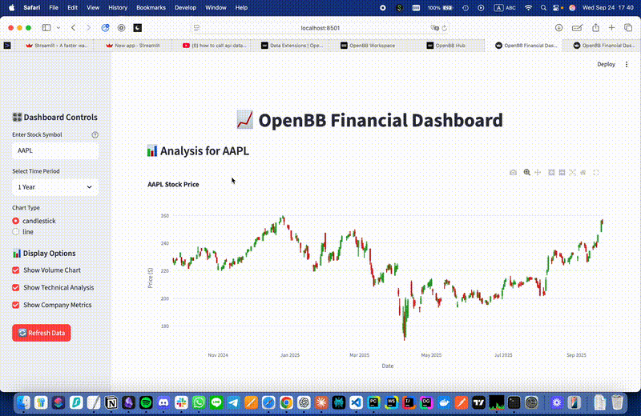

# OpenBB Streamlit Dashboard

A practice project exploring **live financial data** with Streamlit and the OpenBB Platform. The dashboard fetches real-time stock data via **OpenBB/yfinance** and displays it in interactive charts and metrics.

## Features

- 📈 Live stock price data with candlestick & line charts
- 📊 Technical indicators (SMA, RSI, MACD)
- 🔎 Company fundamentals & ratios
- 📰 Latest financial news integration
- ⚡ Caching for performance

## Project Structure

```
OpenBB/
├── app.py                     # Main Streamlit application
├── streamlit_project/
│   ├── __init__.py
│   ├── data_fetcher.py         # Data collection via OpenBB/yfinance
│   └── visualizations.py       # Chart generation & UI components
├── requirements.txt            # Python dependencies
└── .venv/                      # Local virtual environment (ignored in Git)
```

## Getting Started

### 1. Clone the repository

```bash
git clone https://github.com/<your-username>/OpenBB-Streamlit.git
cd OpenBB-Streamlit
```

### 2. Set up environment

```bash
python -m venv .venv
source .venv/bin/activate   # macOS/Linux
# .venv\Scripts\activate    # Windows PowerShell
pip install -r requirements.txt
```

### 3. Run the dashboard

```bash
streamlit run app.py
```

Visit the app at http://localhost:8501

If port 8501 is already in use:

```bash
streamlit run app.py --server.port 8502
```

## Purpose

This repository is for **practice** working with live API data in Python. The project showcases how to integrate financial data APIs into a Streamlit dashboard and organize a small, modular codebase.

## Screenshot Preview

*Add screenshot of dashboard here*



## Dependencies

- `streamlit` - Web application framework
- `openbb` - Financial data platform
- `yfinance` - Yahoo Finance data
- `plotly` - Interactive charts
- `pandas` - Data manipulation
- `numpy` - Numerical computing

## Contributing

This is a learning project, but feel free to fork and experiment with your own features!

## License

MIT License - see [LICENSE](LICENSE) file for details
